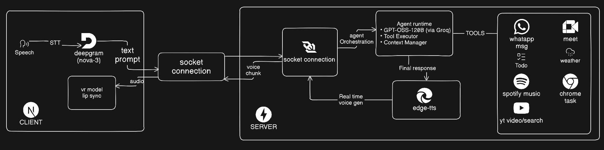

# JARVIS – AI Voice Agent with Tool Calling & 3D Avatar


---

## Introduction

JARVIS is a real-time AI voice agent that combines speech recognition, large language models, tool calling, and a fully interactive 3D avatar to deliver a natural conversational experience.

Unlike traditional chatbots, JARVIS can listen, reason, take actions, and respond through natural speech while visually interacting through a live VRM avatar. The system is powered by GPT-OSS-120B running on Groq, enabling low-latency conversations and autonomous task execution.

The project is built using a modern event-driven architecture with WebSockets, real-time audio streaming, agent orchestration, and dynamic tool execution.

---

## The Problem

Most AI assistants are limited to simple text conversations and cannot effectively interact with real-world applications.

Users often need to:

* Open applications
* Search YouTube
* Control Spotify
* Send messages
* Manage tasks
* Check weather
* Join meetings

Existing assistants typically require multiple manual steps and lack a natural, human-like interaction model.

---

## The Solution

JARVIS combines:

* Real-time Speech-to-Text
* Large Language Models
* Agentic Tool Calling
* Context Management
* Real-time Text-to-Speech
* Interactive 3D Avatar Rendering

to create an AI assistant capable of understanding user intent and autonomously executing tasks through external tools.

---

# Core Features

## 🤖 Agentic AI Runtime

JARVIS operates as an autonomous AI agent rather than a traditional chatbot.

### Capabilities

* Natural language understanding
* Multi-step reasoning
* Context-aware conversations
* Tool orchestration
* Task execution
* Real-time decision making

The reasoning engine is powered by:

* GPT-OSS-120B
* Groq Inference Engine

allowing ultra-fast response generation and tool invocation.

---

## 🛠 Tool Calling & Automation

JARVIS can autonomously invoke tools based on user intent.

### Supported Integrations

#### Communication

* WhatsApp Messaging

#### Entertainment

* Spotify Control
* YouTube Search
* YouTube Playback

#### Productivity

* Google Meet
* To-Do Management

#### Utility

* Weather Information
* Browser Automation
* Local Application Launching

The agent automatically determines which tool to execute without requiring predefined commands.

---

## 🗣 Speech Processing

### Speech-to-Text

Powered by:

* Deepgram Nova-3

Features:

* Real-time transcription
* Streaming audio processing
* Low-latency speech recognition

### Text-to-Speech

Powered by:

* Microsoft Edge TTS

Features:

* Natural voice synthesis
* Streaming audio generation
* Real-time playback

---

## ⚡ Real-Time Streaming Architecture

JARVIS uses WebSockets for bidirectional communication between the frontend and backend.

### Streaming Pipeline

Speech Input
→ Deepgram STT
→ Agent Runtime
→ Tool Execution
→ Response Generation
→ Edge-TTS
→ Audio Streaming
→ Avatar Lip Sync

Benefits:

* Near real-time responses
* Continuous audio streaming
* Reduced latency
* Interactive conversations

---

## 🎭 Interactive 3D Avatar

JARVIS includes a fully animated VRM avatar powered by Three.js.

### Features

* VRM Model Rendering
* Dynamic Blinking
* Idle Animations
* Speech Lip Synchronization
* Real-Time Reactions

The avatar responds visually to generated speech, creating a more immersive user experience.

---

# 🏗 Architecture Overview



The architecture consists of four major layers:

---

## Client Layer

Built with Next.js and Three.js.

Responsibilities:

* Capture microphone input
* Render VRM avatar
* Play generated audio
* Handle lip synchronization
* Maintain WebSocket connection

Components:

* Speech Input
* Deepgram STT
* VRM Avatar
* Audio Player
* WebSocket Client

---

## Communication Layer

A persistent WebSocket channel enables real-time communication.

Streams:

* User prompts
* Audio chunks
* Tool execution events
* Agent responses

This architecture eliminates traditional request-response bottlenecks.

---

## Agent Runtime

The AI core responsible for reasoning and action execution.

### Components

#### GPT-OSS-120B (via Groq)

Handles:

* Intent understanding
* Planning
* Response generation
* Tool selection

#### Tool Executor

Responsible for:

* Executing external actions
* Managing integrations
* Returning execution results

#### Context Manager

Maintains:

* Conversation history
* Session state
* User context

allowing coherent multi-turn interactions.

---

## Voice Generation Pipeline

Response Flow:

1. Agent generates response
2. Response sent to Edge-TTS
3. Audio synthesized in real time
4. Audio chunks streamed over WebSockets
5. Frontend plays audio immediately
6. Avatar lip-sync updates dynamically

This enables natural voice conversations with minimal delay.

---

# Tech Stack

## Frontend

* Next.js
* React
* TypeScript
* Three.js
* @pixiv/three-vrm
* TailwindCSS
* WebSockets

## Backend

* FastAPI
* Python
* AsyncIO
* WebSockets

## AI & Voice

* GPT-OSS-120B
* Groq
* Deepgram Nova-3
* Microsoft Edge TTS

## Integrations

* Spotify API
* YouTube
* WhatsApp
* Google Meet
* Browser Automation

---

# Key Engineering Highlights

* Built a real-time AI voice assistant using Deepgram STT, GPT-OSS-120B, and Edge-TTS.
* Designed an agent runtime with tool-calling and context management capabilities.
* Implemented bidirectional WebSocket communication for streaming conversations.
* Developed a modular tool execution framework supporting autonomous task execution.
* Integrated a live VRM avatar with real-time lip synchronization and speech animation.
* Engineered an event-driven architecture for low-latency voice interactions.

---

# Getting Started

## Prerequisites

* Python 3.10+
* Node.js 20+
* Bun
* Groq API Key
* Deepgram API Key

---

## Backend Setup

```bash
cd jarvis_ai

uv pip install -r requirements.txt

python main.py
```

Runs on:

```bash
http://localhost:8000
```

---

## Frontend Setup

```bash
cd jarvis_web

bun install

bun dev
```

Runs on:

```bash
http://localhost:3000
```

---

## Environment Variables

```env
GROQ_API_KEY=
DEEPGRAM_API_KEY=
```

Additional integration credentials may be required for Spotify, WhatsApp, and Google services.

---

# Future Improvements

* Long-term memory using vector databases
* Multi-agent collaboration
* RAG-based knowledge retrieval
* Custom voice cloning
* Mobile companion application
* Computer-use agent capabilities

---

## JARVIS

**Listen. Reason. Act.**
A real-time AI voice agent designed to bridge conversational intelligence with real-world task execution.
